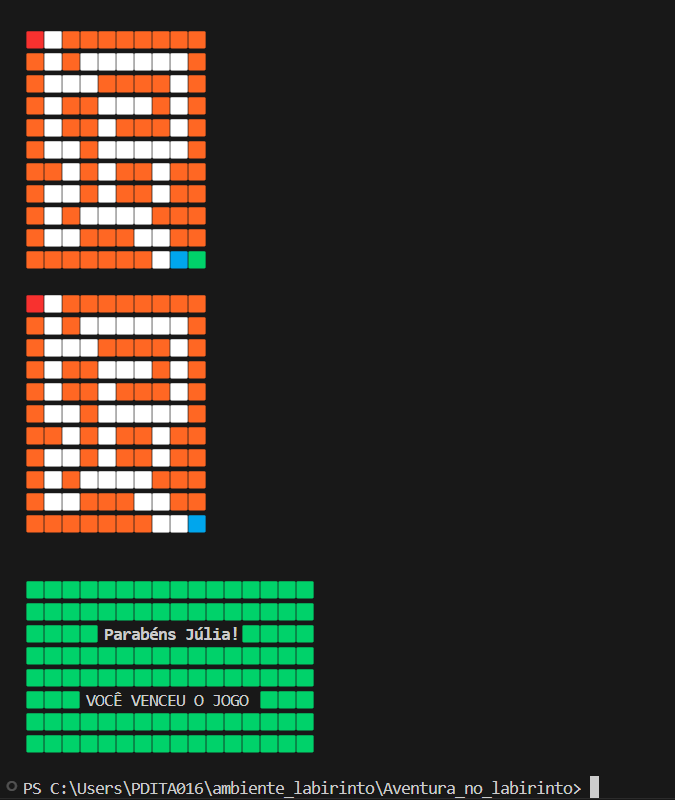

Aventura no Labirinto é um jogo interativo de exploração onde você, o jogador, deve encontrar a saída de um labirinto se movendo com comandos do teclado.

Como Jogar
Use as setas do teclado para mover seu personagem:
O seu personagem será representado por um quadrado azul: 🟦
O objetivo é alcançar a saída representada por quadrado verde: 🟩 

Bibliotecas necessárias:
No arquivo "requerimentos.txt" estão declaradas as bibliotecas necessárias para executar o jogo

Executando o jogo:
utilize o comando "python main.py --name (seu_nome)"
o argumento --name é obrigatório, substitua (seu_nome) pelo seu nome no comando